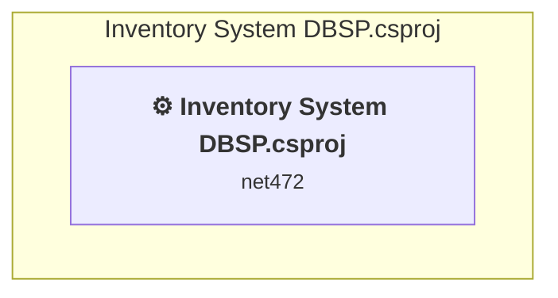

# Projects and dependencies analysis

This document provides a comprehensive overview of the projects and their dependencies in the context of upgrading to .NETCoreApp,Version=v10.0.

## Table of Contents

- [Executive Summary](#executive-Summary)
  - [Highlevel Metrics](#highlevel-metrics)
  - [Projects Compatibility](#projects-compatibility)
  - [Package Compatibility](#package-compatibility)
  - [API Compatibility](#api-compatibility)
- [Aggregate NuGet packages details](#aggregate-nuget-packages-details)
- [Top API Migration Challenges](#top-api-migration-challenges)
  - [Technologies and Features](#technologies-and-features)
  - [Most Frequent API Issues](#most-frequent-api-issues)
- [Projects Relationship Graph](#projects-relationship-graph)
- [Project Details](#project-details)

  - [Inventory System DBSP.csproj](#inventory-system-dbspcsproj)

## Executive Summary

### Highlevel Metrics

| Metric | Count | Status |
| :--- | :---: | :--- |
| Total Projects | 1 | All require upgrade |
| Total NuGet Packages | 1 | All packages need upgrade |
| Total Code Files | 10 |  |
| Total Code Files with Incidents | 9 |  |
| Total Lines of Code | 959 |  |
| Total Number of Issues | 693 |  |
| Estimated LOC to modify | 690+ | at least 71.9% of codebase |

### Projects Compatibility

| Project | Target Framework | Difficulty | Package Issues | API Issues | Est. LOC Impact | Description |
| :--- | :---: | :---: | :---: | :---: | :---: | :--- |
| [Inventory System DBSP.csproj](#inventory-system-dbspcsproj) | net472 | 🟡 Medium | 1 | 690 | 690+ | ClassicWinForms, Sdk Style = False |

### Package Compatibility

| Status | Count | Percentage |
| :--- | :---: | :---: |
| ✅ Compatible | 0 | 0.0% |
| ⚠️ Incompatible | 1 | 100.0% |
| 🔄 Upgrade Recommended | 0 | 0.0% |
| ***Total NuGet Packages*** | ***1*** | ***100%*** |

### API Compatibility

| Category | Count | Impact |
| :--- | :---: | :--- |
| 🔴 Binary Incompatible | 440 | High - Require code changes |
| 🟡 Source Incompatible | 250 | Medium - Needs re-compilation and potential conflicting API error fixing |
| 🔵 Behavioral change | 0 | Low - Behavioral changes that may require testing at runtime |
| ✅ Compatible | 959 |  |
| ***Total APIs Analyzed*** | ***1649*** |  |

## Aggregate NuGet packages details

| Package | Current Version | Suggested Version | Projects | Description |
| :--- | :---: | :---: | :--- | :--- |
| MaterialSkin.2 | 2.3.1 |  | [Inventory System DBSP.csproj](#inventory-system-dbspcsproj) | ⚠️NuGet package is incompatible |

## Top API Migration Challenges

### Technologies and Features

| Technology | Issues | Percentage | Migration Path |
| :--- | :---: | :---: | :--- |
| Windows Forms | 549 | 79.6% | Windows Forms APIs for building Windows desktop applications with traditional Forms-based UI that are available in .NET on Windows. Enable Windows Desktop support: Option 1 (Recommended): Target net9.0-windows; Option 2: Add <UseWindowsDesktop>true</UseWindowsDesktop>; Option 3 (Legacy): Use Microsoft.NET.Sdk.WindowsDesktop SDK. |
| GDI+ / System.Drawing | 106 | 15.4% | System.Drawing APIs for 2D graphics, imaging, and printing that are available via NuGet package System.Drawing.Common. Note: Not recommended for server scenarios due to Windows dependencies; consider cross-platform alternatives like SkiaSharp or ImageSharp for new code. |
| Windows Forms Legacy Controls | 58 | 8.4% | Legacy Windows Forms controls that have been removed from .NET Core/5+ including StatusBar, DataGrid, ContextMenu, MainMenu, MenuItem, and ToolBar. These controls were replaced by more modern alternatives. Use ToolStrip, MenuStrip, ContextMenuStrip, and DataGridView instead. |
| Legacy Configuration System | 8 | 1.2% | Legacy XML-based configuration system (app.config/web.config) that has been replaced by a more flexible configuration model in .NET Core. The old system was rigid and XML-based. Migrate to Microsoft.Extensions.Configuration with JSON/environment variables; use System.Configuration.ConfigurationManager NuGet package as interim bridge if needed. |

### Most Frequent API Issues

| API | Count | Percentage | Category |
| :--- | :---: | :---: | :--- |
| T:System.Windows.Forms.Label | 44 | 6.4% | Binary Incompatible |
| T:System.Drawing.Font | 28 | 4.1% | Source Incompatible |
| T:System.Windows.Forms.DataVisualization.Charting.Chart | 21 | 3.0% | Source Incompatible |
| T:System.Windows.Forms.Panel | 21 | 3.0% | Binary Incompatible |
| T:System.Drawing.FontStyle | 20 | 2.9% | Source Incompatible |
| T:System.Windows.Forms.DataGridView | 17 | 2.5% | Binary Incompatible |
| P:System.Windows.Forms.Label.Text | 17 | 2.5% | Binary Incompatible |
| P:System.Windows.Forms.Control.Location | 17 | 2.5% | Binary Incompatible |
| T:System.Windows.Forms.Button | 14 | 2.0% | Binary Incompatible |
| T:System.Drawing.GraphicsUnit | 14 | 2.0% | Source Incompatible |
| T:System.Windows.Forms.Control.ControlCollection | 13 | 1.9% | Binary Incompatible |
| P:System.Windows.Forms.Control.Controls | 13 | 1.9% | Binary Incompatible |
| P:System.Windows.Forms.Control.Font | 12 | 1.7% | Binary Incompatible |
| P:System.Windows.Forms.Control.Size | 12 | 1.7% | Binary Incompatible |
| M:System.Windows.Forms.Control.ControlCollection.Add(System.Windows.Forms.Control) | 10 | 1.4% | Binary Incompatible |
| P:System.Windows.Forms.Label.AutoSize | 9 | 1.3% | Binary Incompatible |
| P:System.Windows.Forms.Control.Name | 9 | 1.3% | Binary Incompatible |
| T:System.Windows.Forms.Timer | 8 | 1.2% | Binary Incompatible |
| T:System.Windows.Forms.DataVisualization.Charting.SeriesCollection | 8 | 1.2% | Source Incompatible |
| P:System.Windows.Forms.DataVisualization.Charting.Chart.Series | 8 | 1.2% | Source Incompatible |
| T:System.Windows.Forms.DataVisualization.Charting.Series | 8 | 1.2% | Source Incompatible |
| P:System.Windows.Forms.Control.TabIndex | 8 | 1.2% | Binary Incompatible |
| M:System.Windows.Forms.Label.#ctor | 7 | 1.0% | Binary Incompatible |
| F:System.Drawing.GraphicsUnit.Pixel | 7 | 1.0% | Source Incompatible |
| M:System.Drawing.Font.#ctor(System.String,System.Single,System.Drawing.FontStyle,System.Drawing.GraphicsUnit) | 7 | 1.0% | Source Incompatible |
| T:System.Windows.Forms.DataVisualization.Charting.ChartAreaCollection | 6 | 0.9% | Source Incompatible |
| P:System.Windows.Forms.DataVisualization.Charting.Chart.ChartAreas | 6 | 0.9% | Source Incompatible |
| T:System.Windows.Forms.DataVisualization.Charting.ChartArea | 6 | 0.9% | Source Incompatible |
| T:System.Windows.Forms.MessageBoxIcon | 6 | 0.9% | Binary Incompatible |
| T:System.Windows.Forms.MessageBoxButtons | 6 | 0.9% | Binary Incompatible |
| P:System.Windows.Forms.Control.ForeColor | 6 | 0.9% | Binary Incompatible |
| T:System.Windows.Forms.Keys | 6 | 0.9% | Binary Incompatible |
| F:System.Drawing.FontStyle.Regular | 6 | 0.9% | Source Incompatible |
| T:System.Windows.Forms.HorizontalAlignment | 6 | 0.9% | Binary Incompatible |
| T:System.Windows.Forms.RightToLeft | 6 | 0.9% | Binary Incompatible |
| T:System.Windows.Forms.CharacterCasing | 6 | 0.9% | Binary Incompatible |
| T:System.Windows.Forms.ImageLayout | 6 | 0.9% | Binary Incompatible |
| P:System.Windows.Forms.Control.Enabled | 5 | 0.7% | Binary Incompatible |
| T:System.Data.SqlClient.SqlConnection | 5 | 0.7% | Source Incompatible |
| M:System.Windows.Forms.Control.Focus | 5 | 0.7% | Binary Incompatible |
| T:System.Drawing.Image | 5 | 0.7% | Source Incompatible |
| T:System.Windows.Forms.DataGridViewCellStyle | 4 | 0.6% | Binary Incompatible |
| F:System.Drawing.FontStyle.Bold | 4 | 0.6% | Source Incompatible |
| M:System.Drawing.Font.#ctor(System.String,System.Single) | 4 | 0.6% | Source Incompatible |
| T:System.Windows.Forms.DataVisualization.Charting.Axis | 4 | 0.6% | Source Incompatible |
| T:System.Data.SqlClient.SqlCommand | 4 | 0.6% | Source Incompatible |
| M:System.Data.SqlClient.SqlConnection.#ctor(System.String) | 4 | 0.6% | Source Incompatible |
| M:System.Drawing.Font.#ctor(System.String,System.Single,System.Drawing.FontStyle) | 3 | 0.4% | Source Incompatible |
| T:System.Windows.Forms.DataGridViewSelectionMode | 3 | 0.4% | Binary Incompatible |
| T:System.Windows.Forms.DataGridViewAutoSizeColumnsMode | 3 | 0.4% | Binary Incompatible |

## Projects Relationship Graph

Legend:
📦 SDK-style project
⚙️ Classic project

## Project Details

### Inventory System DBSP.csproj

#### Project Info

- **Current Target Framework:** net472
- **Proposed Target Framework:** net10.0-windows
- **SDK-style**: False
- **Project Kind:** ClassicWinForms
- **Dependencies**: 0
- **Dependants**: 0
- **Number of Files**: 13
- **Number of Files with Incidents**: 9
- **Lines of Code**: 959
- **Estimated LOC to modify**: 690+ (at least 71.9% of the project)

#### Dependency Graph

Legend:
📦 SDK-style project
⚙️ Classic project

### API Compatibility

| Category | Count | Impact |
| :--- | :---: | :--- |
| 🔴 Binary Incompatible | 440 | High - Require code changes |
| 🟡 Source Incompatible | 250 | Medium - Needs re-compilation and potential conflicting API error fixing |
| 🔵 Behavioral change | 0 | Low - Behavioral changes that may require testing at runtime |
| ✅ Compatible | 959 |  |
| ***Total APIs Analyzed*** | ***1649*** |  |

#### Project Technologies and Features

| Technology | Issues | Percentage | Migration Path |
| :--- | :---: | :---: | :--- |
| Windows Forms Legacy Controls | 58 | 8.4% | Legacy Windows Forms controls that have been removed from .NET Core/5+ including StatusBar, DataGrid, ContextMenu, MainMenu, MenuItem, and ToolBar. These controls were replaced by more modern alternatives. Use ToolStrip, MenuStrip, ContextMenuStrip, and DataGridView instead. |
| Legacy Configuration System | 8 | 1.2% | Legacy XML-based configuration system (app.config/web.config) that has been replaced by a more flexible configuration model in .NET Core. The old system was rigid and XML-based. Migrate to Microsoft.Extensions.Configuration with JSON/environment variables; use System.Configuration.ConfigurationManager NuGet package as interim bridge if needed. |
| GDI+ / System.Drawing | 106 | 15.4% | System.Drawing APIs for 2D graphics, imaging, and printing that are available via NuGet package System.Drawing.Common. Note: Not recommended for server scenarios due to Windows dependencies; consider cross-platform alternatives like SkiaSharp or ImageSharp for new code. |
| Windows Forms | 549 | 79.6% | Windows Forms APIs for building Windows desktop applications with traditional Forms-based UI that are available in .NET on Windows. Enable Windows Desktop support: Option 1 (Recommended): Target net9.0-windows; Option 2: Add <UseWindowsDesktop>true</UseWindowsDesktop>; Option 3 (Legacy): Use Microsoft.NET.Sdk.WindowsDesktop SDK. |

